# ATCS Update - Game Level For Tremulous
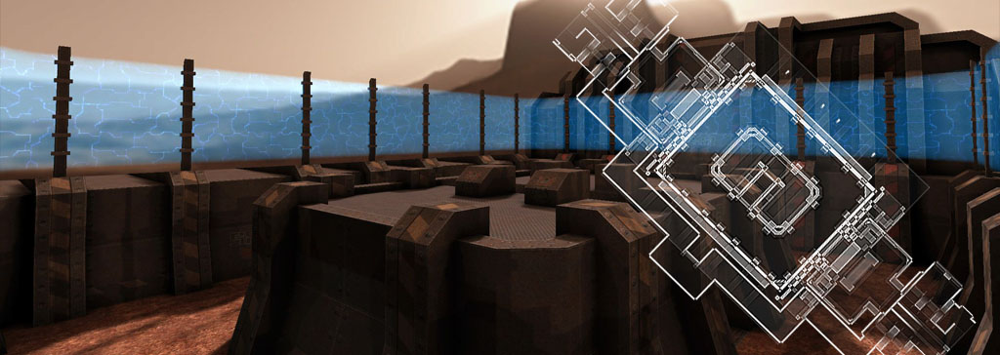

## Overview:
ATCS Update (formerly known as ATCS Reworked) is an upgraded game level for ATCS, designed by Matthias "Masmblr" Peters for the open-source game Tremulous. The primary focus of this update is to enhance the lightmaps. To achieve this, extensive modifications to the brushwork were required, as the decompiled map provided by original package (by) Nicolas "Jex" Jansens) was of subpar quality.

Map Description: 
> Classic ATCS gameplay with improved lightmaps.

* * *

## Screenshots:
[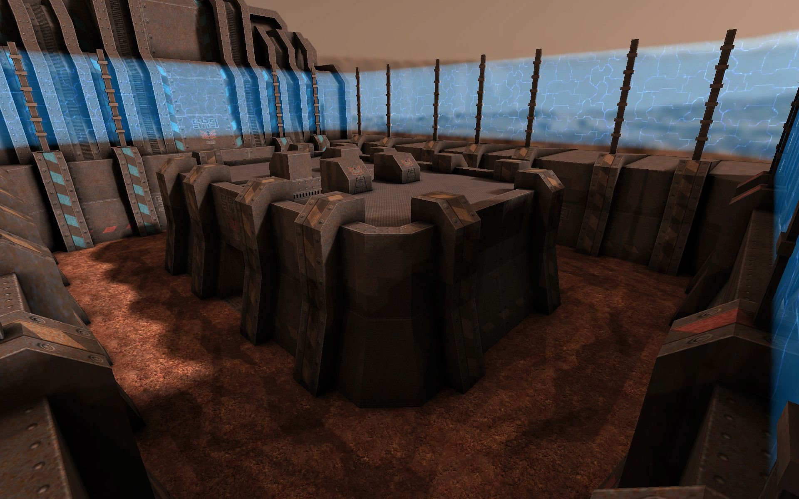](meta/preview_levelshots/1.jpg)
[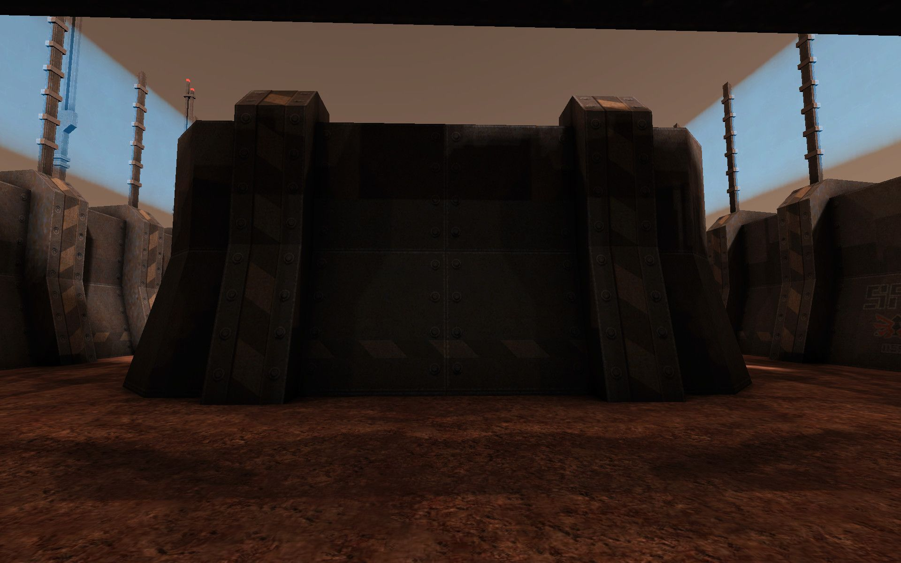](meta/preview_levelshots/2.jpg)
[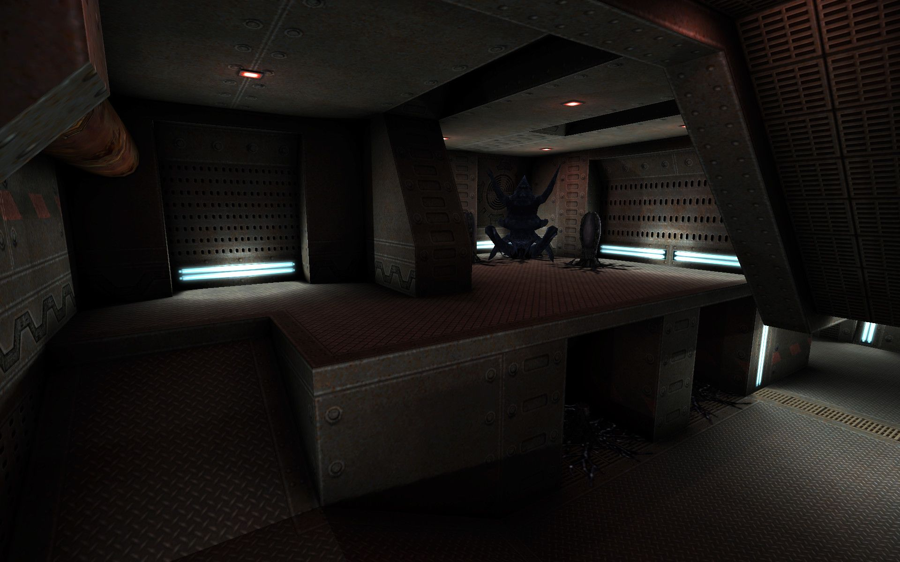](meta/preview_levelshots/3.jpg)
[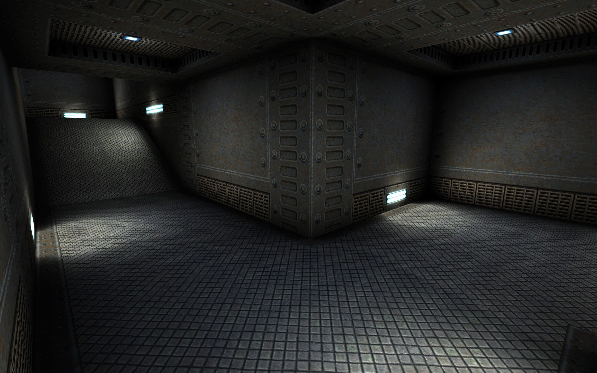](meta/preview_levelshots/4.jpg)
[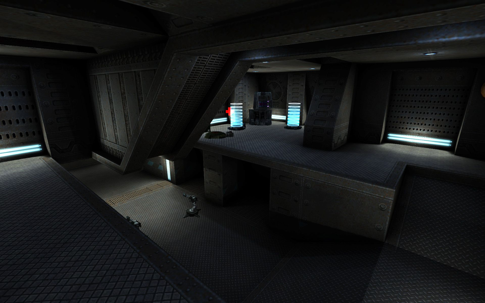](meta/preview_levelshots/5.jpg)
[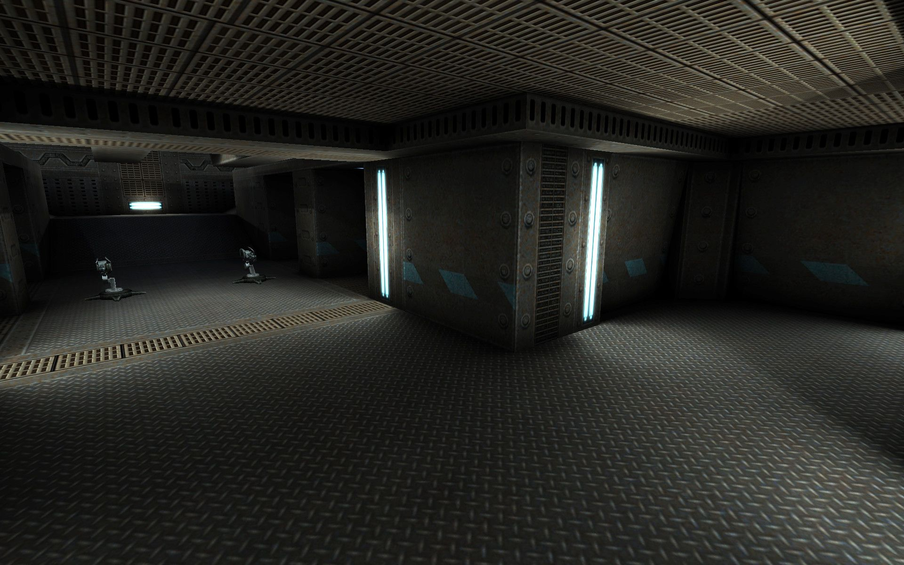](meta/preview_levelshots/6.jpg)
[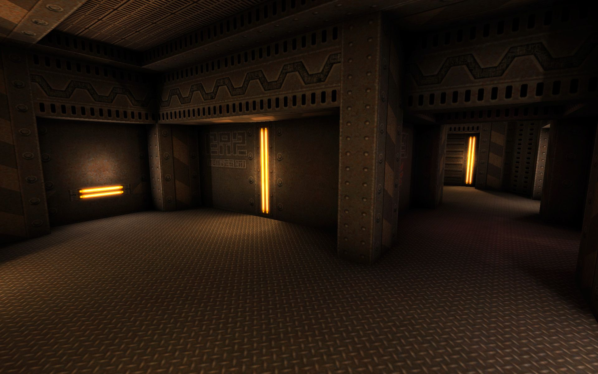](meta/preview_levelshots/7.jpg)
[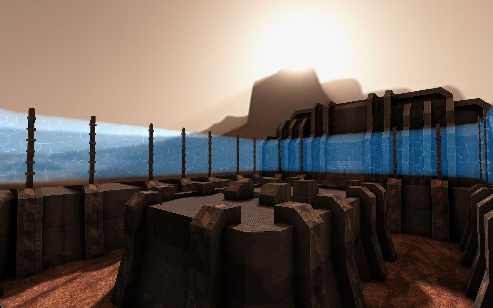](meta/preview_levelshots/8.jpg)
[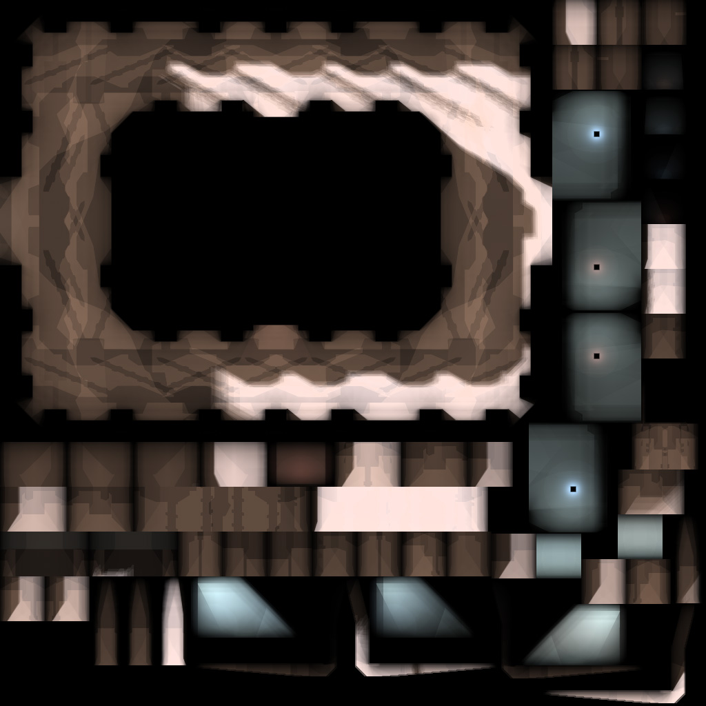](meta/preview_levelshots/9.jpg)

These are screenshots from an early testphase (reworked) showing higher res-lightmaps: </br>
[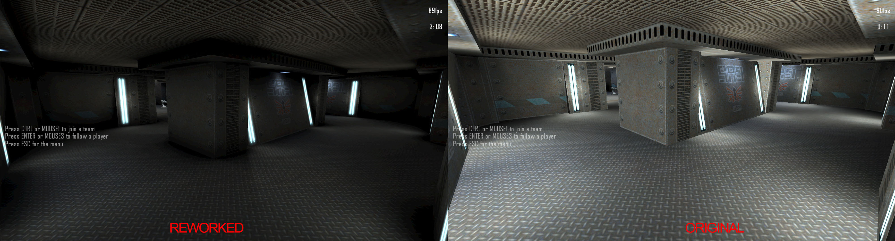](meta/preview_levelshots/reworked_compare_1.jpg)
[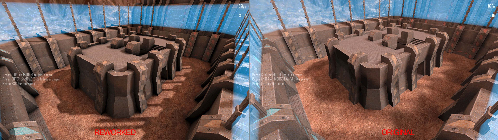](meta/preview_levelshots/reworked_compare_2.jpg)
[](meta/preview_levelshots/reworked_compare_3.jpg)
[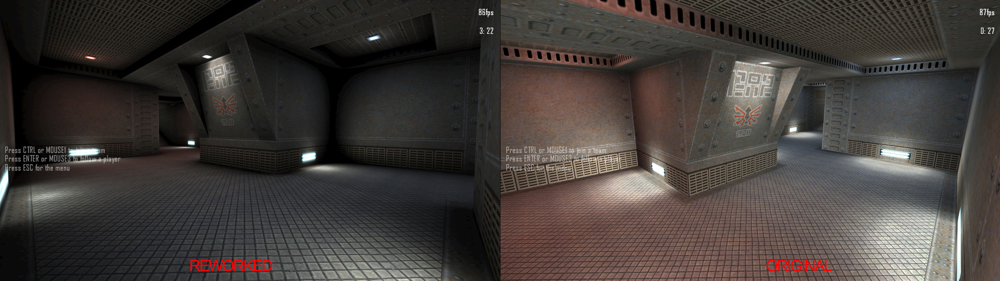](meta/preview_levelshots/reworked_compare_4.jpg)

## Version History:
| Version: | Date:        | Status: | Release Build (.pk3):       
| ------- | ------------- | ------: | -----------------: |
| 1.0     | 16/05/2016  | stable | :x:        |     
| 1.1     | 25/05/2016  | final | [💾](https://github.com/Masmblr/map-ATCS_Update_src/releases/tag/v1.1) |

## How-To
**Binary**:
1. Download the release package.
2. Save the *.pk3 file to the following directory: `/%PATH%/Tremulous/base/`.
3. Start the Tremulous game and select "Create Server" with the desired map.

**Source**:
1. Download the [source release](https://github.com/Masmblr/map-ATCS_Update_src/releases/tag/v1.1) and the [tremulous-common-files](https://github.com/Masmblr/tremulous-map-common/releases/tag/v1.0).
2. Extract the files to the default installation directory. It should look like this:

```
DRIVE:/%PATH%/tremulous/
|   tremulous.exe
|   tremulous.x86
|   ...
+---base
|   |   autogen.cfg
|   |   data-1.1.0.pk3
|   |   map-atcs-1.1.0.pk3
|   |   ...
|   +---env
|   +---maps 
|   +---models 
|   +---scripts
|   +---sounds
|   \---textures
```
1. Download [NetRadiant Level Editor](https://netradiant.gitlab.io/page/download/).
2. Launch NetRadiant and select "Tremulous" as your game setting.
3. Open the '.map' file located in the directory `/%PATH%/tremulous/base/maps` and, from the menu, choose 'Build -> 'Build with final settings.'
4. Start the Tremulous game with `-sv_pure 0 -devmap MAPNAME`. Make sure to replace "MAPNAME" with the actual name of the map you compiled.

## Development Tools:
Photoshop CS6 \
[Audacity](https://www.audacityteam.org/) \
[NetRadiant](https://netradiant.gitlab.io/) \
[Q3Map2](http://q3map2.robotrenegade.com/)

## Related Resources:
Official Tremulous website: https://tremulous.net </br>
NET Radiant Level-Editor: https://netradiant.gitlab.io </br>
Master-Server-List: http://dpmaster.deathmask.net/?game=tremulous </br>
Unofficial successor "Unvanquished": https://unvanquished.net

## Legal Information and Attribution
Some assets may be derivative works or subject to different licenses. Please refer for author and license details. Note that some files may have been modified. Below is a list of files and their legal statuses.

***
env\atcs_update\mars_bk.jpg <sup>[4](#Credit-4)</sup> \
env\atcs_update\mars_dn.jpg <sup>[4](#Credit-4)</sup> \
env\atcs_update\mars_ft.jpg <sup>[4](#Credit-4)</sup> \
env\atcs_update\mars_lf.jpg <sup>[4](#Credit-1)</sup> \
env\atcs_update\mars_rt.jpg <sup>[4](#Credit-4)</sup> \
env\atcs_update\mars_up.jpg <sup>[4](#Credit-4)</sup> \
levelshots\atcs_update.jpg <sup>[1](#Credit-1)</sup> \
maps\atcs_update.map <sup>[1, 2](#Credit-1)</sup> \
scripts\atcs_update.arena <sup>[1](#Credit-1)</sup> \
scripts\atcs_update.particle <sup>[1](#Credit-1)</sup> \
scripts\atcs_update.shader <sup>[1](#Credit-1)</sup> \
scripts\shaderlist.txt <sup>[1](#Credit-1)</sup> \
sounds\atcs_update\firework.wav <sup>[2](#Credit-2)</sup> \
textures\atcs_update\bulb_red.jpg <sup>[2](#Credit-2)</sup> \
textures\atcs_update\cubelight_32_blue.blend.jpg <sup>[2](#Credit-2)</sup> \
textures\atcs_update\cubelight_32_blue.jpg <sup>[2](#Credit-2)</sup> \
textures\atcs_update\cubelight_32_red.blend.jpg <sup>[2](#Credit-2)</sup> \
textures\atcs_update\cubelight_32_red.jpg <sup>[2](#Credit-2)</sup> \
textures\atcs_update\cubelight_32_white.blend.jpg <sup>[2](#Credit-2)</sup> \
textures\atcs_update\cubelight_32_white.jpg <sup>[](#Credit-1)</sup> \
textures\atcs_update\eq2_baselt03_blue.blend.jpg <sup>[3](#Credit-3)</sup> \
textures\atcs_update\eq2_baselt03_blue.jpg <sup>[3](#Credit-3)</sup> \
textures\atcs_update\eq2_baselt03b.blend.jpg <sup>[3](#Credit-3)</sup> \
textures\atcs_update\eq2_baselt03b.jpg <sup>[3](#Credit-3)</sup> \
textures\atcs_update\eq2_baselt03b_blue.blend.jpg <sup>[3](#Credit-3)</sup> \
textures\atcs_update\eq2_baselt03b_blue.jpg <sup>[3](#Credit-3)</sup> \
textures\atcs_update\eq2_bigmet_01.jpg <sup>[3](#Credit-3)</sup> \
textures\atcs_update\eq2_bmtl.jpg <sup>[3](#Credit-3)</sup> \
textures\atcs_update\eq2_bmtl_01.jpg <sup>[3](#Credit-3)</sup> \
textures\atcs_update\eq2_bmtl_02.jpg <sup>[3](#Credit-3)</sup> \
textures\atcs_update\eq2_bmtl_02_384.jpg <sup>[3](#Credit-3)</sup> \
textures\atcs_update\eq2_bmtl_02_384b.jpg <sup>[3](#Credit-3)</sup> \
textures\atcs_update\eq2_bmtl_02up.jpg <sup>[3](#Credit-3)</sup> \
textures\atcs_update\eq2_bmtl_03.jpg <sup>[3](#Credit-3)</sup> \
textures\atcs_update\eq2_bmtl_03_blue.jpg <sup>[3](#Credit-3)</sup> \
textures\atcs_update\eq2_bmtl_03_light.blend.jpg <sup>[3](#Credit-3)</sup> \
textures\atcs_update\eq2_bmtl_03_light.jpg <sup>[3](#Credit-3)</sup> \
textures\atcs_update\eq2_bmtl_03_red.jpg <sup>[3](#Credit-3)</sup> \
textures\atcs_update\eq2_bmtl_04.jpg <sup>[3](#Credit-3)</sup> \
textures\atcs_update\eq2_bmtl_05.jpg <sup>[3](#Credit-3)</sup> \
textures\atcs_update\eq2_bmtl_08.jpg <sup>[3](#Credit-3)</sup> \
textures\atcs_update\eq2_bounce.tga <sup>[3](#Credit-3)</sup> \
textures\atcs_update\eq2_bouncefan.tga <sup>[3](#Credit-3)</sup> \
textures\atcs_update\eq2_fbase.jpg <sup>[3](#Credit-3)</sup> \
textures\atcs_update\eq2_fgrate_01.jpg <sup>[3](#Credit-3)</sup> \
textures\atcs_update\eq2_floor_04.jpg <sup>[3](#Credit-3)</sup> \
textures\atcs_update\eq2_floor_05.jpg <sup>[3](#Credit-3)</sup> \
textures\atcs_update\eq2_floor_06b.jpg <sup>[3](#Credit-3)</sup> \
textures\atcs_update\eq2_grate_01.jpg <sup>[3](#Credit-3)</sup> \
textures\atcs_update\eq2_stepside_01.jpg <sup>[3](#Credit-3)</sup> \
textures\atcs_update\eq2_trim_02.jpg <sup>[3](#Credit-3)</sup> \
textures\atcs_update\eq2_trimh_01.jpg <sup>[3](#Credit-3)</sup> \
textures\atcs_update\eq2_trimh_03c.jpg <sup>[3](#Credit-3)</sup> \
textures\atcs_update\eq2_trimh_03cc.jpg <sup>[3](#Credit-3)</sup> \
textures\atcs_update\eq2_trimv_00.jpg <sup>[3](#Credit-3)</sup> \
textures\atcs_update\eq2_trimv_01b.jpg <sup>[3](#Credit-3)</sup> \
textures\atcs_update\eq2_trimv_02.jpg <sup>[3](#Credit-3)</sup> \
textures\atcs_update\eq2_trimv_04.jpg <sup>[3](#Credit-3)</sup> \
textures\atcs_update\eq2_trimv_05.jpg <sup>[3](#Credit-3)</sup> \
textures\atcs_update\eq2_trimv_05b.jpg <sup>[3](#Credit-3)</sup> \
textures\atcs_update\eq2_trimv_09b.jpg <sup>[3](#Credit-3)</sup> \
textures\atcs_update\eq2_trimv_10b.jpg <sup>[3](#Credit-3)</sup> \
textures\atcs_update\eq2_trimv_11.jpg <sup>[3](#Credit-3)</sup> \
textures\atcs_update\eq2_trimv_11d.jpg <sup>[3](#Credit-3)</sup> \
textures\atcs_update\eq2_trimv_11d_blue.jpg <sup>[3](#Credit-3)</sup> \
textures\atcs_update\eq2_trimv_11d_red.jpg <sup>[3](#Credit-3)</sup> \
textures\atcs_update\eq2_trimv_12b.jpg <sup>[3](#Credit-3)</sup> \
textures\atcs_update\eq2_trimv_mini.jpg <sup>[3](#Credit-3)</sup> \
textures\atcs_update\eq2_trimv_mini02.jpg <sup>[3](#Credit-3)</sup> \
textures\atcs_update\eq2_trimv_mini02b.jpg <sup>[3](#Credit-3)</sup> \
textures\atcs_update\force_field.jpg <sup>[2](#Credit-2)</sup> \
textures\atcs_update\force_grid.jpg <sup>[2](#Credit-2)</sup> \
textures\atcs_update\rockground.jpg <sup>[2](#Credit-2)</sup> \
textures\atcs_update\rust_2.jpg <sup>[2](#Credit-2)</sup> \
textures\atcs_update\sparkle_blue.jpg <sup>[2](#Credit-2)</sup> \
textures\atcs_update\sparkle_red.jpg <sup>[2](#Credit-2)</sup> \
***

### Credit-1

[Matthias "Masmblr Peters"](mailto:masmblr@gmail.com) \
Content: Map, Textures, Shaders \
License: [MIT License](https://opensource.org/license/mit/).
(See "LICENSE" file for more Informations.)

### Credit-2

Nicolas "Jex" Jansens \
Content: ATCS \
License: Attribution License

### Credit-3

[Yves Allaire](http://www.evillair.net/) \
Content: eQ2 Textures \
License: Attribution License

### Credit-4

[[HAU]TOT](http://tot.hau-clan.de) \
Content: Mars SkyBox \
License: Attribution License

### Credit-0

Author, Origin and License unknown \
For this group and its associated files, the rights and claims of other parties under different legal provisions remain unaltered or are subject to their respective licensing regulations.

## Special Thanks:
* id Software for Quake3
* Dark Legion Development for Tremulous
* Team Xonotic for NetRadiant 
